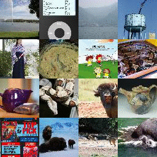

<p align="center">
  
</p>

<p align="center">
  
  <a href="https://aimagelab.github.io/mammoth/index.html"></a>
  
</p>

# Mammoth - An Extendible (General) Continual Learning Framework for Pytorch

Mammoth is a framework for continual learning research. With **more than 50 methods and 20 datasets**, it includes the most complete list competitors and benchmarks for research purposes.

The core idea of Mammoth is that it is designed to be modular, easy to extend, and - most importantly - _easy to debug_.
Ideally, all the code necessary to run the experiments is included _in the repository_, without needing to check out other repositories or install additional packages.

With Mammoth, nothing is set in stone. You can easily add new models, datasets, training strategies, or functionalities.

**[Check out the official DOCUMENTATION](https://aimagelab.github.io/mammoth/) for more information on how to use Mammoth!**

<p align="center">
  
  
  
  
  
  
</p>

## Setup

- Install with `pip install -r requirements.txt`. NOTE: Pytorch version >= 2.1.0 is required for scaled_dot_product_attention (see: https://github.com/Lightning-AI/litgpt/issues/763). If you cannot support this requirement, uncomment the lines 136-139 under `scaled_dot_product_attention` in `backbone/vit.py`.
- Use `main.py` or `./utils/main.py` to run experiments.
- New models can be added to the `models/` folder.
- New datasets can be added to the `datasets/` folder.

## Update roadmap

All the code is under active development. Here are some of the features we are working on:

- **Configurations for datasets**: Currently, each dataset represents a *specific configuration* (e.g., number of tasks, data augmentations, backbone, etc.). This makes adding a new *setting* a bit cumbersome. We are working on a more flexible way to define configurations, while leaving the current system as a default for retro-compatibility.
- **New models**: We are working on adding new models to the repository.
- **New training modalities**: We will introduce new CL training regimes, such a *regression*, *segmentation*, *detection*, etc.
- **Openly accessible result dashboard**: We are working on a dashboard to visualize the results of all the models in both their respective settings (to prove their reproducibility) and in a general setting (to compare them). *This may take some time, since compute is not free.*

All the new additions will try to preserve the current structure of the repository, making it easy to add new functionalities with a simple merge.

## Models

Mammoth currently supports **more than 50** models, with new releases covering the main competitors in literature.

- Efficient Lifelong Learning with A-GEM (A-GEM, A-GEM-R - A-GEM with reservoir buffer): `agem`, `agem_r`.
- AttriCLIP: A Non-Incremental Learner for Incremental Knowledge Learning (AttriCLIP): `attriclip`.
- Bias Correction (BiC): `bic`.
- CaSpeR-IL (on DER++, X-DER with RPC, iCaRL, and ER-ACE): `derpp_casper`, `xder_rpc_casper`, `icarl_casper`, `er_ace_casper`.
- Continual Contrastive Interpolation Consistency (CCIC) - _Requires_ `pip install kornia`: `ccic`.
- Continual Generative training for Incremental prompt-Learning (CGIL): `cgil`
- Contrastive Language-Image Pre-Training (CLIP): `clip` (*static* method with no learning).
- CODA-Prompt: COntinual Decomposed Attention-based Prompting for Rehearsal-Free Continual Learning (CODA-Prompt) - _Requires_ `pip install timm==0.9.8`: `coda-prompt`.
- CSCCT (on DER++, X-DER with RPC, iCaRL, and ER-ACE): `derpp_cscct`, `xder_rpc_cscct`, `icarl_cscct`, `er_ace_cscct`.
- Generating Instance-level Prompts for Rehearsal-free Continual Learning (DAP): `dap`.
- Dark Experience for General Continual Learning: a Strong, Simple Baseline (DER & DER++): `der` and `derpp`.
- DualPrompt: Complementary Prompting for Rehearsal-free Continual Learning (DualPrompt) - _Requires_ `pip install timm==0.9.8`: `dualprompt`.
- Experience Replay (ER): `er`.
- Experience Replay with Asymmetric Cross-Entropy (ER-ACE): `er_ace`.
- May the Forgetting Be with You: Alternate Replay for Learning with Noisy Labels (AER & ABS): `er_ace_aer_abs`.
- Rethinking Experience Replay: a Bag of Tricks for Continual Learning (ER-ACE with tricks): `er_ace_tricks`.
- online Elastic Weight Consolidation (oEWC): `ewc_on`.
- Function Distance Regularization (FDR): `fdr`.
- Greedy Sampler and Dumb Learner (GDumb): `gdumb`.
- Gradient Episodic Memory (GEM) - _Unavailable on windows_: `gem`.
- Greedy gradient-based Sample Selection (GSS): `gss`.
- Hindsight Anchor Learning (HAL): `hal`.
- Incremental Classifier and Representation Learning (iCaRL): `icarl`.
- Image-aware Decoder Enhanced à la Flamingo with Interleaved Cross-attentionS (IDEFICS): `idefics` (*static* method with no learning).
- Joint training for the General Continual setting: `joint_gcl` (_only for General Continual_).
- Learning to Prompt (L2P) - _Requires_ `pip install timm==0.9.8`: `l2p`.
- LiDER (on DER++, iCaRL, GDumb, and ER-ACE): `derpp_lider`, `icarl_lider`, `gdumb_lider`, `er_ace_lider`.
- Large Language and Vision Assistant (LLAVA): `llava` (*static* method with no learning).
- Learning a Unified Classifier Incrementally via Rebalancing (LUCIR): `lucir`.
- Learning without Forgetting (LwF): `lwf`.
- Learning without Shortcuts (LwS): `lws`.
- Learning without Forgetting adapted for Multi-Class classification (LwF.MC): `lwf_mc` (from the iCaRL paper).
- Meta-Experience Replay (MER): `mer`.
- Mixture-of-Experts Adapters (MoE Adapters): `moe_adapters`.
- Progressive Neural Networks (PNN): `pnn`.
- Online Continual Learning on a Contaminated Data Stream with Blurry Task Boundaries (PuriDivER): `puridiver`.
- Random Projections and Pre-trained Models for Continual Learning (RanPAC): `ranpac`.
- Regular Polytope Classifier (RPC): `rpc`.
- Synaptic Intelligence (SI): `si`.
- SLCA: Slow Learner with Classifier Alignment for Continual Learning on a Pre-trained Model (SLCA) - _Requires_ `pip install timm==0.9.8`: `slca`.
- Slow Learner with Classifier Alignment (SLCA): `slca`.
- Semantic Two-level Additive Residual Prompt (STAR-Prompt): `starprompt`. Also includes the first-stage only (`first_stage_starprompt`) and second-stage only (`second_stage_starprompt`) versions.
- Transfer without Forgetting (TwF): `twf`.
- eXtended-DER (X-DER): `xder` (full version), `xder_ce` (X-DER with CE), `xder_rpc` (X-DER with RPC).
- ZSCL: Zero-Shot Continual Learning: `zscl`.

## Datasets

**NOTE**: Datasets are automatically downloaded in `data/`.
- This can be changed by changing the `base_path` function in `utils/conf.py` or using the `--base_path` argument.
- The `data/` folder should not be tracked by git and is created automatically if missing.

Mammoth currently includes **21** datasets, covering *toy classification problems* (different versions of MNIST), *standard domains* (CIFAR, Imagenet-R, TinyImagenet, MIT-67), *fine-grained classification domains* (Cars-196, CUB-200), *aerial domains* (EuroSAT-RGB, Resisc45), *medical domains* (CropDisease, ISIC, ChestX).

- Sequential MNIST (_Class-Il / Task-IL_): `seq-mnist`.
- Permuted MNIST (_Domain-IL_): `perm-mnist`.
- Rotated MNIST (_Domain-IL_): `rot-mnist`.
- MNIST-360 (_General Continual Learning_): `mnist-360`.
- Sequential CIFAR-10 (_Class-Il / Task-IL_): `seq-cifar10`.
- Sequential CIFAR-10 resized 224x224 (ViT version) (_Class-Il / Task-IL_): `seq-cifar10-224`.
- Sequential CIFAR-10 resized 224x224 (ResNet50 version) (_Class-Il / Task-IL_): `seq-cifar10-224-rs`.
- Sequential Tiny ImageNet (_Class-Il / Task-IL_): `seq-tinyimg`.
- Sequential Tiny ImageNet resized 32x32 (_Class-Il / Task-IL_): `seq-tinyimg-r`.
- Sequential CIFAR-100 (_Class-Il / Task-IL_): `seq-cifar100`.
- Sequential CIFAR-100 resized 224x224 (ViT version) (_Class-Il / Task-IL_): `seq-cifar100-224`.
- Sequential CIFAR-100 resized 224x224 (ResNet50 version) (_Class-Il / Task-IL_): `seq-cifar100-224-rs`.
- Sequential CUB-200 (_Class-Il / Task-IL_): `seq-cub200`.
- Sequential ImageNet-R (_Class-Il / Task-IL_): `seq-imagenet-r`.
- Sequential Cars-196 (_Class-Il / Task-IL_): `seq-cars196`.
- Sequential RESISC45 (_Class-Il / Task-IL_): `seq-resisc45`.
- Sequential EuroSAT-RGB (_Class-Il / Task-IL_): `seq-eurosat-rgb`.
- Sequential ISIC (_Class-Il / Task-IL_): `seq-isic`.
- Sequential ChestX (_Class-Il / Task-IL_): `seq-chestx`.
- Sequential MIT-67 (_Class-Il / Task-IL_): `seq-mit67`.
- Sequential CropDisease (_Class-Il / Task-IL_): `seq-cropdisease`.
- Sequential CelebA (_Biased-Class-Il_): `seq-celeba`. *This dataset is multi-label (i.e., trains with binary cross-entropy)*

## Citing the library

```
@article{boschini2022class,
  title={Class-Incremental Continual Learning into the eXtended DER-verse},
  author={Boschini, Matteo and Bonicelli, Lorenzo and Buzzega, Pietro and Porrello, Angelo and Calderara, Simone},
  journal={IEEE Transactions on Pattern Analysis and Machine Intelligence},
  year={2022},
  publisher={IEEE}
}

@inproceedings{buzzega2020dark,
 author = {Buzzega, Pietro and Boschini, Matteo and Porrello, Angelo and Abati, Davide and Calderara, Simone},
 booktitle = {Advances in Neural Information Processing Systems},
 editor = {H. Larochelle and M. Ranzato and R. Hadsell and M. F. Balcan and H. Lin},
 pages = {15920--15930},
 publisher = {Curran Associates, Inc.},
 title = {Dark Experience for General Continual Learning: a Strong, Simple Baseline},
 volume = {33},
 year = {2020}
}
```

## On the reproducibility of Mammoth

We take great pride and care in the reproducibility of the models in Mammoth and we are commited to provide the community with the most accurate results possible. To this end, we provide a `REPRODUCIBILITY.md` file in the repository that contains the results of the models in Mammoth.

The performance of each model is evaluated on the same dataset used in the paper and we report in `REPRODUCIBILITY.md` our results compared to the results reported in the paper. We also provide the exact command used to train the model (most times, it follows `python main.py --model <model-name> --dataset <dataset-name> --model_config best`).

We encourage the community to report any issues with the reproducibility of the models in Mammoth. If you find any issues, please open an issue in the GitHub repository or contact us directly.

**Disclaimer**: Since there are many models in Mammoth (and some of them predate PyTorch), the process of filling the `REPRODUCIBILITY.md` file is ongoing. We are working hard to fill the file with the results of all models in Mammoth. If you need the results of a specific model, please open an issue in the GitHub repository or contact us directly.

> *Does this mean that the models that are not in the `REPRODUCIBILITY.md` file do not reproduce?*
    
  No! It means that we have not yet found the appropriate dataset and hyperparameters to fill the file with the results of that model. We are working hard to fill the file with the results of all models in Mammoth. If you need the results of a specific model, please open an issue in the GitHub repository or contact us directly.

## Contributing

Pull requests welcome!

Please use `autopep8` with parameters:

- `--aggressive`
- `--max-line-length=200`
- `--ignore=E402`

### Previous versions

If you're interested in a version of this repo that only includes the original code for [Dark Experience for General Continual Learning: a Strong, Simple Baseline](https://papers.nips.cc/paper/2020/hash/b704ea2c39778f07c617f6b7ce480e9e-Abstract.html) or [Class-Incremental Continual Learning into the eXtended DER-verse](https://arxiv.org/abs/2201.00766>), please use the following tags:

- [neurips2020](https://github.com/aimagelab/mammoth/releases/tag/neurips2020) for DER (NeurIPS 2020).
- [tpami2023](https://github.com/aimagelab/mammoth/releases/tag/tpami2023) for X-DER (TPAMI 2022).
