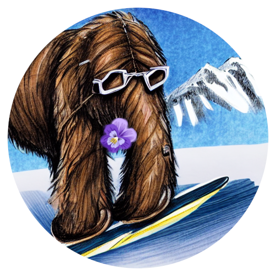

Welcome to Mammoth's documentation!
===================================

Mammoth - An Extendible (General) Continual Learning Framework for Pytorch
==========================================================================

Official repository of `Class-Incremental Continual Learning into the eXtended DER-verse <https://arxiv.org/abs/2201.00766>`_ and `Dark Experience for General Continual Learning: a Strong, Simple Baseline <https://papers.nips.cc/paper/2020/hash/b704ea2c39778f07c617f6b7ce480e9e-Abstract.html>`_

Mammoth is a framework for continual learning research. It is designed to be modular, easy to extend, and - most importantly - *easy to debug*.
Idelly, all the code necessary to run the experiments is included *in the repository*, without needing to check out other repositories or install additional packages. 

With Mammoth, nothing is set in stone. You can easily add new models, datasets, training strategies, or functionalities.

**NEW**: Join our Discord Server for all your Mammoth-related questions → 

.. list-table::
   :widths: 15 15 15 15 15 15
   :class: centered
   :stub-columns: 0

   * - .. image:: images/seq_mnist.gif
         :alt: Sequential MNIST
         :height: 112px
         :width: 112px

     - .. image:: images/seq_cifar10.gif
         :alt: Sequential CIFAR-10
         :height: 112px
         :width: 112px

     - .. image:: images/seq_tinyimg.gif
         :alt: Sequential TinyImagenet
         :height: 112px
         :width: 112px

     - .. image:: images/perm_mnist.gif
         :alt: Permuted MNIST
         :height: 112px
         :width: 112px

     - .. image:: images/rot_mnist.gif
         :alt: Rotated MNIST
         :height: 112px
         :width: 112px

     - .. image:: images/mnist360.gif
         :alt: MNIST-360
         :height: 112px
         :width: 112px

Setup
-----

- Use ``./utils/main.py`` to run experiments.
- Use argument ``--load_best_args`` to use the best hyperparameters from the paper.
- New models can be added to the ``models/`` folder.
- New datasets can be added to the ``datasets/`` folder.

Models
------

- Efficient Lifelong Learning with A-GEM: (A-GEM), and A-GEM with Reservoir buffer (A-GEM-R)
- Bias Correction (BiC)
- Continual Contrastive Interpolation Consistency (CCIC) - *Requires* ``pip install kornia``
- CODA-Prompt: COntinual Decomposed Attention-based Prompting for Rehearsal-Free Continual Learning (CODA-Prompt) - *Requires* ``pip install timm==0.9.8``
- Dark Experience Replay (DER)
- Dark Experience Replay++ (DER++)
- DualPrompt: Complementary Prompting for Rehearsal-free Continual Learning (DualPrompt) - *Requires* ``pip install timm==0.9.8``
- Experience Replay (ER)
- online Elastic Weight Consolidation (oEWC)
- Function Distance Regularization (FDR)
- Greedy Sampler and Dumb Learner (GDumb)
- Gradient Episodic Memory (GEM) - *Unavailable on windows*
- Greedy gradient-based Sample Selection (GSS)
- Hindsight Anchor Learning (HAL)
- Incremental Classifier and Representation Learning (iCaRL)
- Joint for `General Continual`` setting (JointGCL)
- Learning to Prompt (L2P) - *Requires* ``pip install timm==0.9.8``
- LiDER (on DER++, iCaRL, GDumb, and ER-ACE)
- Learning a Unified Classifier Incrementally via Rebalancing (LUCIR)
- Learning without Forgetting (LwF)
- Meta-Experience Replay (MER)
- Progressive Neural Networks (PNN)
- Regular Polytope Classifier (RPC)
- Synaptic Intelligence (SI)
- SLCA: Slow Learner with Classifier Alignment for Continual Learning on a Pre-trained Model (SLCA) - *Requires* ``pip install timm==0.9.8``
- Transfer without Forgetting (TwF)
- eXtended-DER (X-DER)

Datasets
--------

**NOTE**: Datasets are automatically downloaded in the ``data/``.
- This can be changed by changing the ``base_path`` function in ``utils/conf.py``.
- The ``data/`` folder is not tracked by git and is created automatically if missing.

- Sequential MNIST (*Class-Il / Task-IL*)
- Sequential CIFAR-10 (*Class-Il / Task-IL*)
- Sequential Tiny ImageNet (*Class-Il / Task-IL*)
- Sequential Tiny ImageNet resized 32x32 (*Class-Il / Task-IL*)
- Sequential CIFAR-100 (*Class-Il / Task-IL*)
- Sequential CIFAR-100 resized 224x224 (ViT version) (*Class-Il / Task-IL*)
- Sequential CIFAR-100 resized 224x224 (ResNet50 version) (*Class-Il / Task-IL*)
- Permuted MNIST (*Domain-IL*)
- Rotated MNIST (*Domain-IL*)
- MNIST-360 (*General Continual Learning*)
- Sequential CUB-200 (*Class-Il / Task-IL*)
- Sequential ImageNet-R (*Class-Il / Task-IL*)

Pretrained backbones
--------------------

- `ResNet18 on cifar100 <https://onedrive.live.com/embed?cid=D3924A2D106E0039&resid=D3924A2D106E0039%21108&authkey=AFsCv4BR-bmTUII>`_
- `ResNet18 on TinyImagenet resized (seq-tinyimg-r) <https://onedrive.live.com/embed?cid=D3924A2D106E0039&resid=D3924A2D106E0039%21106&authkey=AKTxp5LFQJ9z9Ok>`_
- `ResNet50 on ImageNet (pytorch version) <https://onedrive.live.com/embed?cid=D3924A2D106E0039&resid=D3924A2D106E0039%21107&authkey=ADHhbeg9cUoqJ0M>`_
- `ResNet18 on SVHN <https://unimore365-my.sharepoint.com/:u:/g/personal/215580_unimore_it/ETdCpRoA891KsAAuibMKWYwBX_3lfw3dMbE4DFEkhOm96A?e=NjdzLN>`_

Citing these works
------------------

.. code-block:: bibtex

     @article{boschini2022class,
         title={Class-Incremental Continual Learning into the eXtended DER-verse},
         author={Boschini, Matteo and Bonicelli, Lorenzo and Buzzega, Pietro and Porrello, Angelo and Calderara, Simone},
         journal={IEEE Transactions on Pattern Analysis and Machine Intelligence},
         year={2022},
         publisher={IEEE}
     }

     @inproceedings{buzzega2020dark,
        author = {Buzzega, Pietro and Boschini, Matteo and Porrello, Angelo and Abati, Davide and Calderara, Simone},
        booktitle = {Advances in Neural Information Processing Systems},
        editor = {H. Larochelle and M. Ranzato and R. Hadsell and M. F. Balcan and H. Lin},
        pages = {15920--15930},
        publisher = {Curran Associates, Inc.},
        title = {Dark Experience for General Continual Learning: a Strong, Simple Baseline},
        volume = {33},
        year = {2020}
     }

Awesome Papers using Mammoth
----------------------------

Our Papers
~~~~~~~~~~~

- `Dark Experience for General Continual Learning: a Strong, Simple Baseline (NeurIPS 2020) <https://arxiv.org/abs/2004.07211>`_
- `Rethinking Experience Replay: a Bag of Tricks for Continual Learning (ICPR 2020) <https://arxiv.org/abs/2010.05595>`_ (`code <https://github.com/hastings24/rethinking_er>`_)
- `Class-Incremental Continual Learning into the eXtended DER-verse (TPAMI 2022) <https://arxiv.org/abs/2201.00766>`_
- `Effects of Auxiliary Knowledge on Continual Learning (ICPR 2022) <https://arxiv.org/abs/2206.02577>`_
- `Transfer without Forgetting (ECCV 2022) <https://arxiv.org/abs/2206.00388>`_ (`code <https://github.com/mbosc/twf>`_)
- `Continual semi-supervised learning through contrastive interpolation consistency (PRL 2022) <https://arxiv.org/abs/2108.06552>`_ (`code <https://github.com/aimagelab/CSSL>`_)
- `On the Effectiveness of Lipschitz-Driven Rehearsal in Continual Learning (NeurIPS 2022) <https://arxiv.org/abs/2210.06443>`_ (`code <https://github.com/aimagelab/lider>`_)

Other Awesome CL works using Mammoth
~~~~~~~~~~~~~~~~~~~~~~~~~~~~~~~~~~~~

.. admonition::

    **Get in touch if we missed your awesome work!**

`- Decoupling Learning and Remembering: a Bilevel Memory Framework with Knowledge Projection for Task-Incremental Learning (CVPR2023) <(https://openaccess.thecvf.com/content/CVPR2023/papers/Sun_Decoupling_Learning_and_Remembering_A_Bilevel_Memory_Framework_With_Knowledge_CVPR_2023_paper.pdf)>`_ (`code <(https://github.com/SunWenJu123/BMKP)>`_)
`- Regularizing Second-Order Influences for Continual Learning (CVPR2023) <(https://openaccess.thecvf.com/content/CVPR2023/papers/Sun_Regularizing_Second-Order_Influences_for_Continual_Learning_CVPR_2023_paper.pdf)>`_ (`code <(https://github.com/feifeiobama/InfluenceCL)>`_)
`- Sparse Coding in a Dual Memory System for Lifelong Learning (CVPR2023) <(https://arxiv.org/pdf/2301.05058.pdf)>`_ (`code <(https://github.com/NeurAI-Lab/SCoMMER)>`_)
`- A Unified Approach to Domain Incremental Learning with Memory: Theory and Algorithm (CVPR2023) <(https://arxiv.org/pdf/2310.12244.pdf)>`_ (`code <(https://github.com/Wang-ML-Lab/unified-continual-learning)>`_)
`- A Multi-Head Model for Continual Learning via Out-of-Distribution Replay (CVPR2023) <(https://arxiv.org/pdf/2208.09734.pdf)>`_ (`code <(https://github.com/k-gyuhak/MORE)>`_)
`- Preserving Linear Separability in Continual Learning by Backward Feature Projection (CVPR2023) <(https://arxiv.org/pdf/2303.14595.pdf)>`_ (`code <(https://github.com/rvl-lab-utoronto/BFP)>`_)
`- Complementary Calibration: Boosting General Continual Learning With Collaborative Distillation and Self-Supervision (TIP2023) <(https://ieeexplore.ieee.org/document/10002397)>`_ (`code <(https://github.com/lijincm/CoCa)>`_)
`- Continual Learning by Modeling Intra-Class Variation (TMLR2023) <(https://arxiv.org/abs/2210.05398)>`_ (`code <(https://github.com/yulonghui/MOCA)>`_)
`- ConSlide: Asynchronous Hierarchical Interaction Transformer with Breakup-Reorganize Rehearsal for Continual Whole Slide Image Analysis (ICCV2023) <(https://openaccess.thecvf.com/content/ICCV2023/papers/Huang_ConSlide_Asynchronous_Hierarchical_Interaction_Transformer_with_Breakup-Reorganize_Rehearsal_for_Continual_ICCV_2023_paper.pdf)>`_ (`code <(https://github.com/HKU-MedAI/ConSlide)>`_)
`- CBA: Improving Online Continual Learning via Continual Bias Adaptor (ICCV2023) <(https://arxiv.org/pdf/2308.06925.pdf)>`_ (`code <(https://github.com/wqza/CBA-online-CL)>`_)
`- Neuro-Symbolic Continual Learning: Knowledge, Reasoning Shortcuts and Concept Rehearsal (ICML2023) <(https://arxiv.org/pdf/2302.01242.pdf)>`_ (`code <(https://github.com/ema-marconato/NeSy-CL)>`_)
`- Pretrained Language Model in Continual Learning: a Comparative Study (ICLR2022) <(https://openreview.net/pdf?id=figzpGMrdD)>`_ (`code <(https://github.com/wutong8023/PLM4CL)>`_)
`- Representational continuity for unsupervised continual learning (ICLR2022) <(https://openreview.net/pdf?id=9Hrka5PA7LW)>`_ (`code <(https://github.com/divyam3897/UCL)>`_)
`- Continual Normalization: Rethinking Batch Normalization for Online Continual Learning (ICLR2022) <(https://arxiv.org/abs/2203.16102)>`_ (`code <(https://github.com/phquang/Continual-Normalization)>`_)
`- Learning Fast, Learning Slow: A General Continual Learning Method based on Complementary Learning System (ICLR2022) <(https://arxiv.org/pdf/2201.12604.pdf)>`_ (`code <(https://github.com/NeurAI-Lab/CLS-ER)>`_)
`- New Insights on Reducing Abrupt Representation Change in Online Continual Learning (ICLR2022) <(https://openreview.net/pdf?id=N8MaByOzUfb)>`_ (`code <(https://github.com/pclucas14/AML)>`_)
`- Looking Back on Learned Experiences for Class/Task Incremental Learning (ICLR2022) <(https://openreview.net/pdf?id=RxplU3vmBx)>`_ (`code <(https://github.com/MozhganPourKeshavarz/Cost-Free-Incremental-Learning)>`_)
`- Task Agnostic Representation Consolidation: a Self-supervised based Continual Learning Approach (CoLLAs2022) <(https://arxiv.org/pdf/2207.06267.pdf)>`_ (`code <(https://github.com/NeurAI-Lab/TARC)>`_)
`- Consistency is the key to further Mitigating Catastrophic Forgetting in Continual Learning (CoLLAs2022) <(https://arxiv.org/pdf/2207.04998.pdf)>`_ (`code <(https://github.com/NeurAI-Lab/ConsistencyCL)>`_)
`- Self-supervised models are continual learners (CVPR2022) <(https://arxiv.org/abs/2112.04215)>`_ (`code <(https://github.com/DonkeyShot21/cassle)>`_)
`- Learning from Students: Online Contrastive Distillation Network for General Continual Learning (IJCAI2022) <(https://www.ijcai.org/proceedings/2022/0446.pdf)>`_ (`code <(https://github.com/lijincm/OCD-Net)>`_)

Contributing
------------

Pull requests welcome!

Please use `autopep8` with parameters:

- `--aggressive`
- `--max-line-length=200`
- `--ignore=E402`

Previous versions
-----------------

If you're interested in a version of this repo that only includes the original code for `Dark Experience for General Continual Learning: a Strong, Simple Baseline <https://papers.nips.cc/paper/2020/hash/b704ea2c39778f07c617f6b7ce480e9e-Abstract.html>`_ or `Class-Incremental Continual Learning into the eXtended DER-verse <https://arxiv.org/abs/2201.00766>`_, please use the following tags:

- `neurips2020 <https://github.com/aimagelab/mammoth/releases/tag/neurips2020>`_ for DER (NeurIPS 2020).

- `tpami2023 <https://github.com/aimagelab/mammoth/releases/tag/tpami2023>`_ for X-DER (TPAMI 2023).

